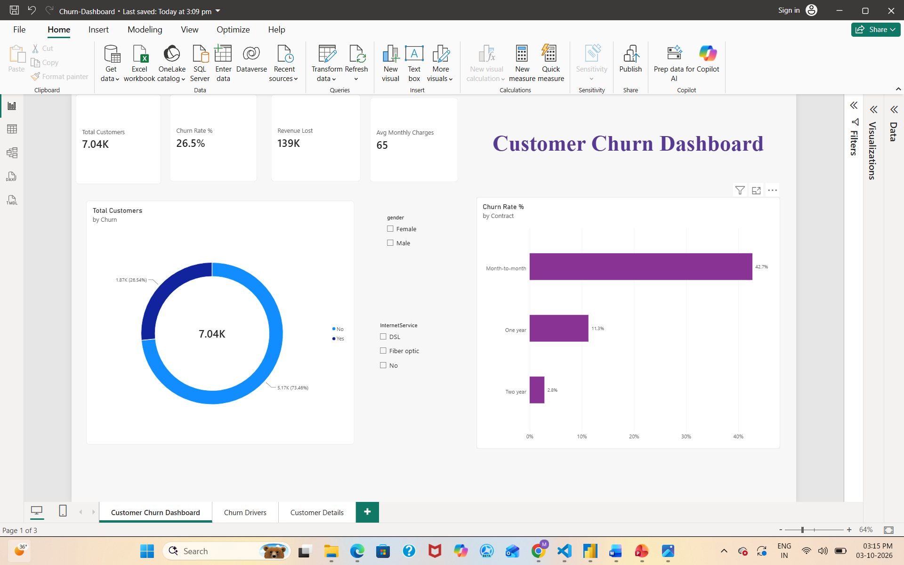
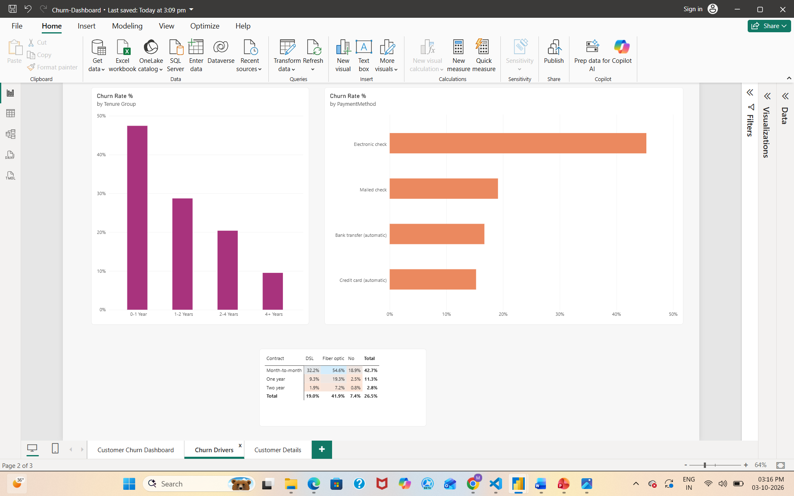
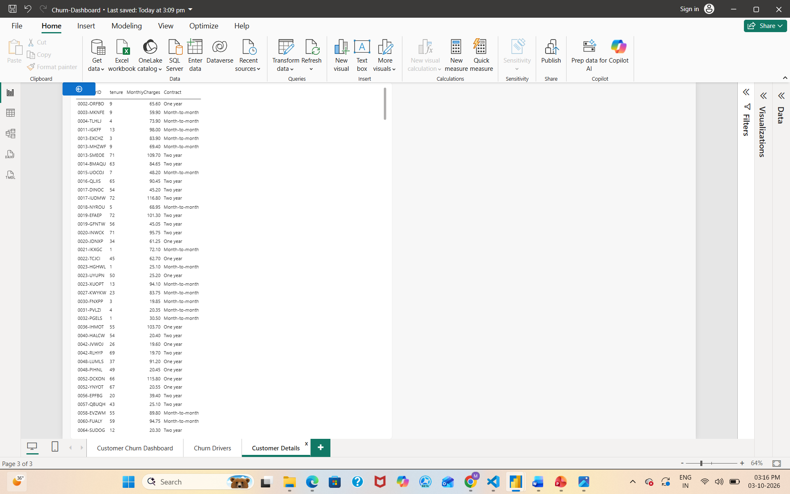

# Customer Churn Analysis Dashboard (Power BI)

## Business Problem
A telecom company is losing customers. This dashboard identifies who is leaving, why, and how much revenue is at risk.

## Dataset
IBM Telco Customer Churn dataset (via Kaggle), 7,043 customers, 21 columns.

## Tools & Skills
- Power BI Desktop
- Power Query (data cleaning)
- DAX (measures, calculated columns)
- Star schema data model (1 fact table, 3 dimension tables)
- Drill-through, slicers, conditional formatting

## What I Did
1. Cleaned data in Power Query (fixed data types, handled blanks).
2. Built a star schema with Dim_Contract, Dim_InternetService and Dim_PaymentMethod.
3. Wrote DAX measures: Total Customers, Churned Customers, Churn Rate %, Retention Rate %, Revenue Lost, Avg Monthly Charges.
4. Created a Tenure Group column using SWITCH.
5. Built a 3-page report: Overview, Churn Drivers, Customer Details (drill-through).

## Key Insights
- Overall churn rate is 26.5%, with about 139K in monthly revenue lost.
- Month-to-month customers churn at 42.7% vs only 2.8% on two-year contracts.
- Customers in their first year churn the most (~47%); churn falls as tenure grows.
- Electronic check users churn the most (~45%) vs ~15-19% for other payment methods.
- Fiber optic + month-to-month is the riskiest segment at 54.6%.

## Recommendations
- Offer discounts to move month-to-month customers onto 1-2 year contracts.
- Run onboarding and retention campaigns in the first 12 months.
- Encourage auto-pay (bank transfer / credit card) over electronic check.
- Investigate service quality for fiber optic customers.

## Screenshots

## Files
- Churn-Dashboard.pbix
- WA_Fn-UseC_-Telco-Customer-Churn.csv
